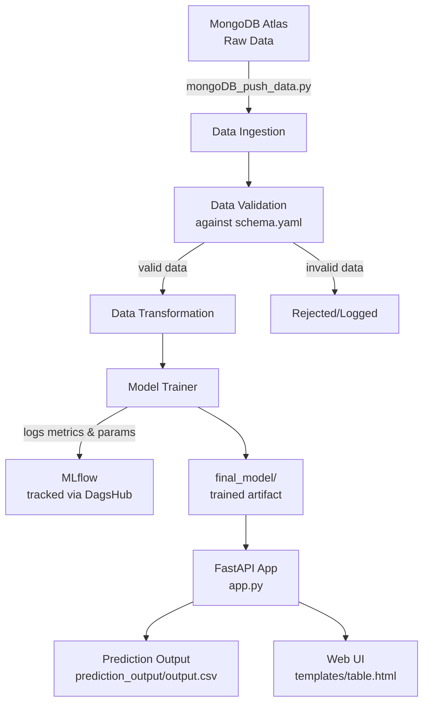

# Network Security — Phishing Detection ML Pipeline

An end-to-end machine learning pipeline that detects phishing/malicious network activity. The project covers the full ML lifecycle — data ingestion from MongoDB, validation, transformation, model training with MLflow (tracked via DagsHub), and deployment via a FastAPI web app — containerized with Docker.

**Repo:** [Shubhanshu-G/NetworkSecurity](https://github.com/Shubhanshu-G/NetworkSecurity)

## Features

- **Data Ingestion** — Pulls raw network/phishing data from MongoDB Atlas
- **Data Validation** — Validates incoming data against a defined schema (`data_schema/schema.yaml`)
- **Data Transformation** — Cleans and transforms data for model training
- **Model Training** — Trains a classification model with experiment tracking via MLflow, remotely logged to DagsHub
- **Prediction Service** — Serves predictions through a FastAPI web interface
- **Custom Logging & Exception Handling** — Centralized logging and exception modules for easier debugging
- **Dockerized** — Dockerfile is complete; image build/deployment (e.g. to a registry/cloud) is still pending

## Project Flow



## Project Structure

```
NetworkSecurity/
├── data_schema/
│   └── schema.yaml                    # Schema used to validate incoming data
├── Network_Data/
│   └── phisingData.csv                # Raw source dataset
├── networksecurity/                   # Core Python package
│   ├── cloud/                         # Cloud integration utilities
│   ├── components/                    # Pipeline stages
│   │   ├── data_ingestion.py
│   │   ├── data_transformation.py
│   │   ├── data_validation.py
│   │   └── model_trainer.py
│   ├── constant/
│   │   └── training_pipeline/         # Pipeline-wide constants/config values
│   ├── entity/
│   │   ├── artifact_entity.py         # Data classes for pipeline artifacts
│   │   └── config_entity.py           # Data classes for pipeline configs
│   ├── exception/
│   │   └── exception.py               # Custom exception handling
│   ├── logging/
│   │   └── logger.py                  # Custom logger setup
│   ├── pipeline/
│   │   └── training_pipeline.py       # Orchestrates the full training pipeline
│   └── utils/
│       ├── main_utils/
│       │   └── utils.py               # General helper functions
│       └── ml_utils/
│           ├── metric/
│           │   └── classification_metric.py  # Model evaluation metrics
│           └── model/
│               └── estimator.py       # Model wrapper/estimator class
├── prediction_output/
│   └── output.csv                     # Saved prediction results
├── templates/
│   └── table.html                     # HTML template for the web app
├── valid_data/
│   └── test.csv                       # Validated test dataset
├── app.py                             # Web app entry point (serves predictions)
├── main.py                            # Training pipeline entry point
├── mongoDB_push_data.py               # Script to push data into MongoDB
├── test_mongoDB.py                    # Script to test MongoDB connectivity
├── mlflow.db                          # MLflow experiment tracking database
├── Dockerfile                         # Container build definition
├── requirements.txt                   # Python dependencies
├── setup.py                           # Package setup script
└── .env                               # Environment variables (not committed)
```

## Environment Variables (`.env`)

```dotenv
MONGO_DB_URL="<your-mongodb-atlas-connection-string>"
DAGSHUB_URL="https://dagshub.com/Shubhanshu-G/NetworkSecurity.mlflow"
```

> **MongoDB Atlas note:** If you get a connection timeout/refused error, go to your MongoDB Atlas dashboard → **Network Access** → **Add IP Address**, and whitelist your current machine's IP (or `0.0.0.0/0` for testing/development only — not recommended for production).

## Prerequisites

- Python 3.8+
- MongoDB instance (local or Atlas)
- Docker (optional, for containerized deployment)

## Setup

1. **Clone the repository**

   ```bash
   git clone https://github.com/Shubhanshu-G/NetworkSecurity.git
   cd NetworkSecurity
   ```

2. **Create and activate a virtual environment**

   ```bash
   python -m venv venv
   venv\Scripts\activate      # Windows
   source venv/bin/activate   # macOS/Linux
   ```

3. **Install dependencies**

   ```bash
   pip install -r requirements.txt
   ```

4. **Configure environment variables**
   Create a `.env` file in the project root (see [Environment Variables](#environment-variables-env) above), and make sure your IP is whitelisted on MongoDB Atlas.

5. **Push data to MongoDB** (first-time setup)

   ```bash
   python mongoDB_push_data.py
   ```

## Usage

### Run the training pipeline

```bash
python main.py
```

This runs data ingestion → validation → transformation → model training, and logs experiments to MLflow.

### View MLflow experiment tracking

Experiments are tracked remotely via DagsHub. View them at:
[https://dagshub.com/Shubhanshu-G/NetworkSecurity.mlflow](https://dagshub.com/Shubhanshu-G/NetworkSecurity.mlflow)

To view local runs instead:

```bash
mlflow ui --backend-store-uri sqlite:///mlflow.db
```

Then open `http://localhost:5000` in your browser.

### Run the web app (predictions)

```bash
python app.py
```

This starts the FastAPI server. Visit `http://localhost:8000/docs` for the interactive Swagger UI.

### Run with Docker
>
> **Status:** Dockerfile is complete and ready to use. Image build/push to a registry and cloud deployment are still pending.

```bash
docker build -t networksecurity .
docker run -p 8000:8000 --env-file .env networksecurity
```

## Testing

```bash
python test_mongoDB.py
```

## Tech Stack

- **Language:** Python
- **Database:** MongoDB Atlas
- **Experiment Tracking:** MLflow, hosted on DagsHub
- **Web Framework:** FastAPI
- **Containerization:** Docker (build complete, deployment pending)

## Notes

- `Network_Data/phisingData.csv` is the raw dataset; validated data used for testing is stored under `valid_data/`.
- Prediction results are written to `prediction_output/output.csv`.
- Sensitive config (`.env`) is excluded from version control — see `.gitignore`.
- Docker image build and cloud deployment are in progress — this section will be updated once complete.

---

*Feel free to update the sections above (tech stack, app framework, exact commands) if any assumptions don't match your actual implementation.*
